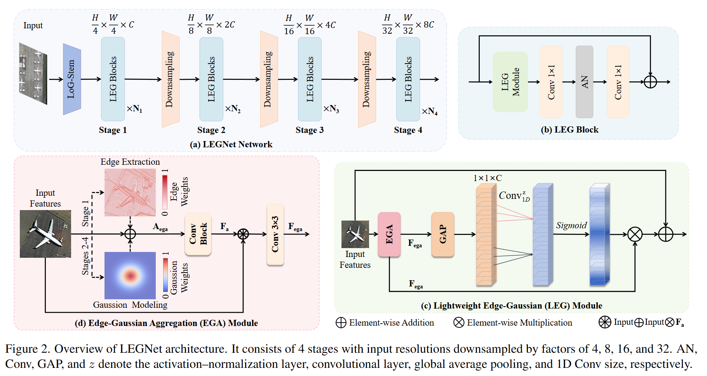

# LEGNet: A Lightweight Edge-Gaussian Network for Low-Quality Remote Sensing Image Object Detection


This is the official Pytorch/Pytorch implementation of the paper: <br/>
> **LEGNet: A Lightweight Edge-Gaussian Network for Low-Quality Remote Sensing Image Object Detection**
>
> Wei Lu, Si-Bao Chen*, Hui-Dong Li, Qing-Ling Shu, Chris H. Q. Ding, Jin Tang, and Bin Luo, Senior Member, IEEE 
> 

----

<p align="center"> 

<p align="center">  Illustration of LEGNet architecture.
</p> 

----

	
[](https://paperswithcode.com/sota/object-detection-on-visdrone-det2019-1?p=legnet-lightweight-edge-gaussian-driven)
[](https://paperswithcode.com/sota/oriented-object-detection-on-dota-1-5?p=legnet-lightweight-edge-gaussian-driven)
[](https://paperswithcode.com/sota/oriented-object-detection-on-dota-1-0?p=legnet-lightweight-edge-gaussian-driven)
[](https://paperswithcode.com/sota/object-detection-in-aerial-images-on-dior-r?p=legnet-lightweight-edge-gaussian-driven)
[](https://paperswithcode.com/sota/object-detection-in-aerial-images-on-dota-1?p=legnet-lightweight-edge-gaussian-driven)


## News 🆕
- **2025.07.11** Congratulations! Our paper "LEGNet: A Lightweight Edge-Gaussian Network for Low-Quality Remote Sensing Image Object Detection" has been accepted by [ICCV 2025 Workshop](https://openaccess.thecvf.com/content/ICCV2025W/SEA/html/Lu_LEGNet_A_Lightweight_Edge-Gaussian_Network_for_Low-Quality_Remote_Sensing_Image_ICCVW_2025_paper.html). 🔥

- **2025.06.02** Update LEGNet V2-version paper in [Arxiv](https://arxiv.org/abs/2503.140121). The new code, models and results are uploaded. 🎈

- **2025.03.18** Update LEGNet original-version paper in [Arxiv](https://arxiv.org/abs/2503.14012v1). The new code, models and results are uploaded. 🎈


<details>
  <summary>
  <font size="+1">Abstract</font>
  </summary>

Remote sensing object detection (RSOD) faces formidable challenges in complex visual environments. Aerial and satellite images inherently suffer from limitations such as low spatial resolution, sensor noise, blurred objects, low-light degradation, and partial occlusions. These degradation factors collectively compromise the feature discriminability in detection models, resulting in three key issues: (1) reduced contrast that hampers foreground-background separation, (2) structural discontinuities in edge representations, and (3) ambiguous feature responses caused by variations in illumination. These collectively weaken model robustness and deployment feasibility. To address these challenges, we propose LEGNet, a lightweight network that incorporates a novel edge-Gaussian aggregation (EGA) module specifically designed for low-quality remote sensing images. Our key innovation lies in the synergistic integration of Scharr operator-based edge priors with uncertainty-aware Gaussian modeling: (a) The orientation-aware Scharr filters preserve high-frequency edge details with rotational invariance; (b) The uncertainty-aware Gaussian layers probabilistically refine lowconfidence features through variance estimation. This design enables precision enhancement while maintaining architectural simplicity. Comprehensive evaluations across four RSOD benchmarks (DOTA-v1.0, v1.5, DIOR-R, FAIR1M-v1.0) and a UAVview dataset (VisDrone2019) demonstrate significant improvements. LEGNet achieves state-of-the-art performance across five benchmark datasets while ensuring computational efficiency, making it well-suited for deployment on resource-constrained edge devices in real-world remote sensing applications.
</details>


## Introduction

The master branch is built on MMRotate which works with **PyTorch 1.6+**.

LEGNet backbone code is placed under mmrotate/models/backbones/, and the train/test configure files are placed under configs/legnet/ 

## Pretrained Weights of Backbones

Imagenet 300-epoch pre-trained LEGNet-Tiny backbone: [Download](https://github.com/lwCVer/LEGNet/releases/download/pre-train/LWEGNet_tiny.pth)

Imagenet 300-epoch pre-trained LEGNet-Small backbone: [Download](https://github.com/lwCVer/LEGNet/releases/download/pre-train/LWEGNet_small.pth)

## Results and Models

DOTA1.0

|           Model            |  mAP  | Angle | training mode | Batch Size |                                     Configs                                      |                                                              Download                                                               |
|:--------------------------:|:-----:| :---: |---------------|:----------:|:--------------------------------------------------------------------------------:|:-----------------------------------------------------------------------------------------------------------------------------------:|
| LEGNet-Tiny (1024,1024,200) | 79.37 | le90  | single-scale  |    2\*4    | [orcnn_legnet_tiny_dota10_test_ss_e36.py](./configs/legnet/orcnn_legnet_tiny_dota10_test_ss_e36.py) |          [model](https://github.com/lwCVer/LEGNet/releases/download/weights/lwegnet_tiny_orcnn_dota19_ss.pth)           |
| LEGNet-Small (1024,1024,200) | 80.03 | le90  | single-scale  |    2\*4    | [orcnn_legnet_small_dota10_test_ss_e36.py](./configs/legnet/orcnn_legnet_small_dota10_test_ss_e36.py) |          [model](https://github.com/lwCVer/LEGNet/releases/download/weights/lwegnet_small_orcnn_dota10_ss.pth)           |


DOTA1.5

|         Model         |  mAP  | Angle | training mode | Batch Size |                                             Configs                                              |                                                     Download                                                     |
| :----------------------: |:-----:| :---: |---| :------: |:------------------------------------------------------------------------------------------------:|:----------------------------------------------------------------------------------------------------------------:|
| LEGNet-Small (1024,1024,200) | 72.89 | le90  | single-scale |    2\*4     | [orcnn_legnet_small_dota10_test_ss_e36.py](./configs/legnet/orcnn_legnet_small_dota15_test_ss_e36.py) | [model](https://github.com/lwCVer/LEGNet/releases/download/weights/lwegnet_small_orcnn_dota15_ss.pth) |

FAIR-v1.0

|         Model         |  mAP  | Angle | training mode | Batch Size |                                             Configs                                              |                                                     Download                                                     |
| :----------------------: |:-----:| :---: |---| :------: |:------------------------------------------------------------------------------------------------:|:----------------------------------------------------------------------------------------------------------------:|
| LEGNet-Small (1024,1024,500) | 48.35 | le90  | multi-scale |    2\*4     | [orcnn_legnet_small_fairv1_test_ms_e12.py](./configs/legnet/orcnn_legnet_small_fairv1_test_ms_e12.py) | [model](https://github.com/lwCVer/LGANet/releases/download/weights/ORCNN_LEGNet_L2_fpn_le90_dota15_ss_e36.pth) |

DIOR-R (Based on mmdetection)

|                    Model                     |  mAP  | Batch Size |
| :------------------------------------------: |:-----:| :--------: |
|                   LEGNet-Small                  | 68.40 |    1\*8    |

## Installation

MMRotate depends on [PyTorch](https://pytorch.org/), [MMCV](https://github.com/open-mmlab/mmcv) and [MMDetection](https://github.com/open-mmlab/mmdetection).
Below are quick steps for installation.
Please refer to [Install Guide](https://mmrotate.readthedocs.io/en/latest/install.html) for more detailed instruction.


```shell
conda create -n LEGNet-Det python=3.8 -y
conda activate LEGNet-Det
conda install pytorch==1.12.0 torchvision==0.13.0 torchaudio==0.12.0 cudatoolkit=11.3 -c pytorch
pip install mmcv-full==1.7.2 -f https://download.openmmlab.com/mmcv/dist/cu113/torch1.12.0/index.html
pip install mmdet
pip install -v -e .
```

## Get Started

Please see [get_started.md](docs/en/get_started.md) for the basic usage of MMRotate.
We provide [colab tutorial](demo/MMRotate_Tutorial.ipynb), and other tutorials for:

- [learn the basics](docs/en/intro.md)
- [learn the config](docs/en/tutorials/customize_config.md)
- [customize dataset](docs/en/tutorials/customize_dataset.md)
- [customize model](docs/en/tutorials/customize_models.md)
- [useful tools](docs/en/tutorials/useful_tools.md)


## Star History

[](https://www.star-history.com/#lwCVer/LEGNet&Date)


## Acknowledgement
This repository is built using the [timm](https://github.com/rwightman/pytorch-image-models) and [mmrotate](https://github.com/open-mmlab/mmrotate) repositories.
MMRotate is an open source project that is contributed by researchers and engineers from various colleges and companies. We appreciate all the contributors who implement their methods or add new features, as well as users who give valuable feedbacks. We wish that the toolbox and benchmark could serve the growing research community by providing a flexible toolkit to reimplement existing methods and develop their own new methods.

If you have any questions about this work, you can contact me. 

Email: [luwei_ahu@qq.com](mailto:luwei_ahu@qq.com); WeChat: lw2858191255.

Your star is the power that keeps us updating github.

## Citation
If LEGNet is useful or relevant to your research, please kindly recognize our contributions by citing our paper:
```
@inproceedings{lu2025legnet,
  title={LEGNet: A Lightweight Edge-Gaussian Network for Low-Quality Remote Sensing Image Object Detection},
  author={Lu, Wei and Chen, Si-Bao and Li, Hui-Dong and Shu, Qing-Ling and Ding, Chris HQ and Tang, Jin and Luo, Bin},
  booktitle={Proceedings of the IEEE/CVF International Conference on Computer Vision},
  pages={2844--2853},
  year={2025}
}
```


## License
Licensed under a [Creative Commons Attribution-NonCommercial 4.0 International](https://creativecommons.org/licenses/by-nc/4.0/) for Non-commercial use only.
Any commercial use should get formal permission first.
